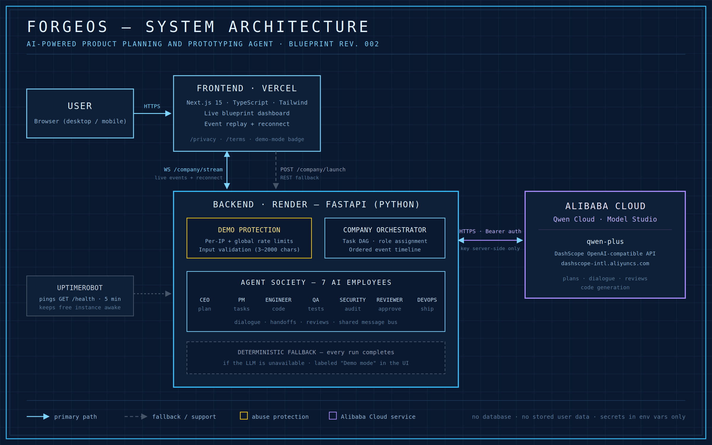

# ForgeOS

**AI-powered product planning and prototyping agent.** Describe a project idea and ForgeOS assembles a crew of AI employees (CEO, Product Manager, Engineer, QA, Security, Reviewer, DevOps) that plans, builds, reviews, and "ships" your product live, streaming every event to a blueprint-styled dashboard.

Built by LayLa Davis for the **Global AI Hackathon Series with Qwen Cloud** — **Track 3: Agent Society**. Licensed under MIT (see `LICENSE`).



```
forgeOS/
  frontend/   # Next.js 15 (App Router) + TypeScript + Tailwind CSS v4 + shadcn/ui
  backend/    # FastAPI (Python) multi-agent orchestration service
```

## Quick start

Backend:

```bash
cd backend
pip install -r requirements.txt
cp .env.example .env          # add your QWEN_API_KEY, or leave empty for demo mode
uvicorn app.main:app --reload --port 8000
```

Frontend (in a second terminal):

```bash
cd frontend
npm install
cp .env.local.example .env.local
npm run dev                    # http://localhost:3000
```

## Architecture

```
Browser (Next.js dashboard)
   |  POST /company/start  ->  { run_id, ws_url }
   |  WS   /company/stream/{run_id}   (live event stream, reconnect w/ ?since=)
   |  POST /company/launch            (REST fallback: full run in one response)
   v
FastAPI backend
   CompanyOrchestrator -> task DAG -> role agents (CEO, PM, Engineer, QA,
   Security, Reviewer, DevOps) -> ordered event timeline
   |
   v
Qwen (qwen-plus) via DashScope's OpenAI-compatible API
```

Key properties:

- **Streaming first.** The frontend opens a WebSocket for live events. If the socket cannot connect, it falls back to a single REST call and replays the events client-side. If both fail, the UI shows a clear error notice instead of a broken page.
- **AI with a deterministic net.** Every agent call is wrapped: if the Qwen API is unreachable, credits are exhausted, or no key is configured, agents fall back to built-in deterministic planning. Runs always complete; the UI labels these runs with a "Demo mode" badge (driven by `plan_source` on the plan).
- **Stateless by design.** Run state lives in process memory only (for stream reconnects); nothing is persisted to a database.
- **One HTTP boundary per side.** `frontend/src/services/api.ts` is the only frontend file that talks HTTP; `backend/app/api/routes.py` is the only backend module that defines endpoints.

Endpoints: `GET /health`, `POST /launch`, `POST /company/launch`, `POST /company/start`, `WS /company/stream/{run_id}`.

### Why multiple agents (Agent Society)

ForgeOS splits the work across seven role agents instead of one large prompt, and the split does real work:

- **Task decomposition and role assignment.** The CEO turns the idea into a plan; the PM decomposes it into a task DAG; each downstream agent (Engineer, QA, Security, Reviewer, DevOps) claims the tasks matching its role. Independent branches of the DAG execute without waiting on each other.
- **Specialized review passes catch different failure classes.** QA, Security, and the Reviewer each audit the Engineer's output against different criteria, and their findings flow back over a shared message bus as structured handoffs rather than one model grading its own work.
- **Disagreement is part of the protocol.** Review agents can reject deliverables, which routes work back with the objection attached; the Reviewer arbitrates before DevOps is allowed to ship.

A formal benchmark against a single-agent baseline (same model, one prompt, same deliverables rubric) is planned future work; the current codebase makes that comparison straightforward to run since both paths share the same orchestrator and event schema.

## Security Considerations

- **Secrets.** The Qwen API key lives only in the backend's server-side environment (`backend/.env`, gitignored; see `.env.example`). The browser never receives it. The only frontend env var is the public backend URL (`NEXT_PUBLIC_FORGEOS_API_URL`).
- **Rate limiting.** LLM-consuming endpoints (`/launch`, `/company/launch`, `/company/start`) enforce a per-IP sliding window (default 5 requests/minute) plus a global hourly budget (default 100 requests/hour) so a public demo cannot drain API credits. Limits are configurable via `RATE_LIMIT_PER_MINUTE` and `RATE_LIMIT_GLOBAL_PER_HOUR`. When deployed behind a reverse proxy, set `TRUST_PROXY=true` so limiting keys on `X-Forwarded-For`.
- **Input validation.** Project ideas are validated server-side (3 to 2000 characters, enforced by Pydantic) and mirrored client-side.
- **Error hygiene.** API errors return generic messages; details go to server logs only. Rate-limit responses return HTTP 429 with a friendly explanation and `Retry-After`.
- **CORS.** Allowed origins are an explicit allowlist from `CORS_ORIGINS`; set it to your deployed frontend URL in production.
- **No stored user data.** No accounts, no database, no cookies. Prompts and results live in process memory for the duration of a run (plus a short reconnect window) and are lost on restart.
- **Known limitations (beta).** Rate limiting is in-memory and per-instance (resets on restart; use Redis if you ever scale horizontally). There is no authentication; the demo relies on rate limits and input validation. The interactive API docs at `/docs` are public, which is intentional for judging.

## Deployment

Recommended free-tier setup: **frontend on Vercel, backend on Render (or Railway/Fly).**

Backend (Render example):

1. New Web Service from this repo, root directory `backend`.
2. Build command: `pip install -r requirements.txt`
3. Start command: `uvicorn app.main:app --host 0.0.0.0 --port $PORT`
4. Environment variables: `QWEN_API_KEY`, `CORS_ORIGINS=https://<your-frontend>.vercel.app`, `TRUST_PROXY=true`, `APP_ENV=production`. Optionally tune the `RATE_LIMIT_*` values.

Frontend (Vercel):

1. Import the repo, root directory `frontend`.
2. Environment variable: `NEXT_PUBLIC_FORGEOS_API_URL=https://<your-backend>.onrender.com`
3. Deploy. WebSockets are used against the backend host, so the backend platform must support them (Render, Railway, and Fly all do).

Local production check: `cd frontend && npm run build` and `cd backend && python verify.py`.

## Notes for judges (Devpost)

- With no `QWEN_API_KEY`, the entire app still works in deterministic demo mode, clearly labeled in the UI. Live AI mode activates the moment a key is added, with zero code changes.
- Legal pages: `/privacy` and `/terms`.
- Demo walkthrough: see `DEMO_SCRIPT.md`.
